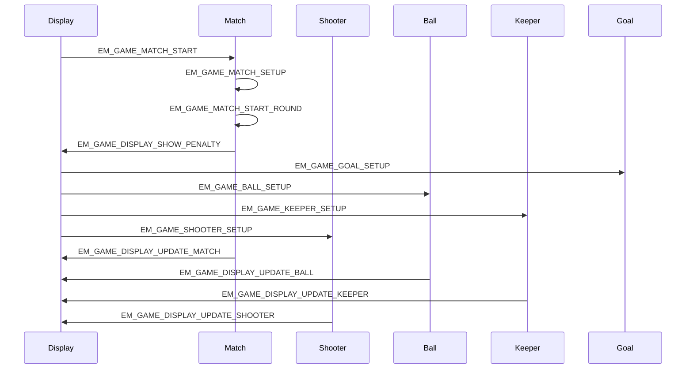
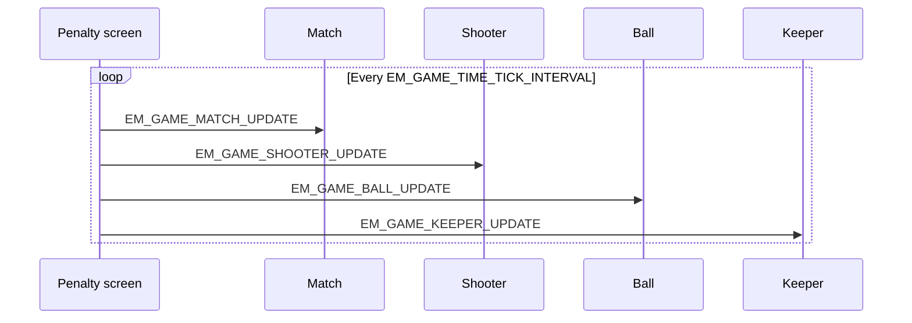
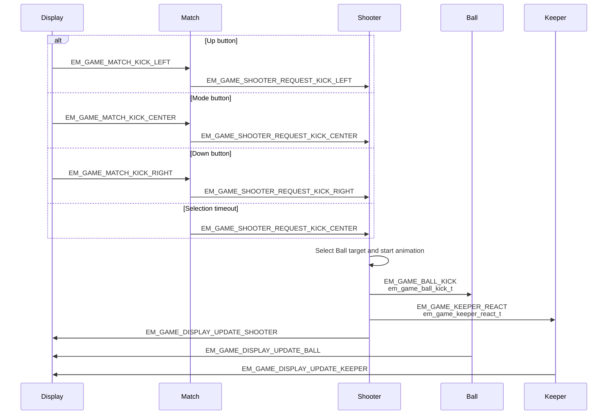
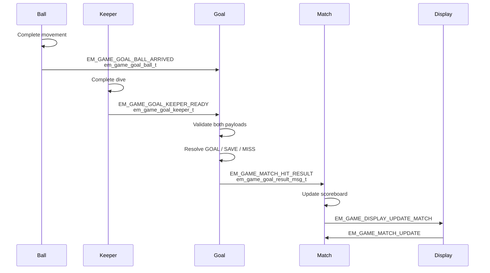

# Eleven Meter object sequences

This document describes state ownership and message flow between the Eleven Meter gameplay tasks. Each task owns its mutable state inside its `.cpp` file. Tasks communicate through AK signals and common-message payloads; no gameplay task reads another task's mutable state directly.

## Object responsibilities

| Object | Owned state | Main responsibility |
|---|---|---|
| Match | Match phase, difficulty, countdown, best score, scoreboard | Coordinate menu, rounds, timing, and final result. |
| Shooter | Kick direction, animation frame, reaction timer, random seed | Process the selected kick and dispatch Ball/Keeper commands. |
| Ball | Position, animation frame, movement target | Animate the shot and report its arrival to Goal. |
| Keeper | Dive direction, difficulty, position, animation frame, random seed | Select and animate the goalkeeper response. |
| Goal | Latest Ball and Keeper reports, readiness flags | Resolve goal, save, or miss after both reports arrive. |
| Display | Read-only snapshots received from gameplay tasks | Compose and render the current OLED view. |

## Start a round

The penalty screen is entered once when a match starts. Later rounds stay on the same screen;
Match posts `RESET` to Goal, Ball, Keeper, and Shooter before starting the next round.

## Shared game loop

Match advances countdown and result timing from this tick. Animated objects use local elapsed
accumulators, so Ball keeps its 50 ms update interval while Shooter and Keeper keep their 80 ms
intervals. The shared periodic timer is stopped when Match leaves gameplay.

## Select and execute a kick

The screen sends the player's input to Match first. Match accepts it only while the round is in `EM_GAME_MATCH_STATE_SHOOTER_WAIT`, clears the countdown, and forwards one object-specific request to Shooter.

Shooter owns the player's kick direction. Ball receives only its movement target, while Keeper receives only the shot zone it needs to choose a dive.

## Resolve the kick

Goal does not inspect Ball or Keeper state. It waits for one message from each object and resolves the attempt only when both reports are ready.

The order of the Ball and Keeper arrival messages is not significant. Goal stores the first valid report and waits for the other one.

While the penalty screen is active, its periodic `EM_GAME_TIME_TICK` drives Match and the
animated gameplay objects without blocking a task handler.

## Display snapshots

Gameplay objects send read-only snapshots to Display whenever their visible state changes:

| Sender | Signal | Payload |
|---|---|---|
| Match | `EM_GAME_DISPLAY_UPDATE_MATCH` | `em_game_match_view_t` |
| Shooter | `EM_GAME_DISPLAY_UPDATE_SHOOTER` | `em_game_shooter_view_t` |
| Ball | `EM_GAME_DISPLAY_UPDATE_BALL` | `em_game_ball_view_t` |
| Keeper | `EM_GAME_DISPLAY_UPDATE_KEEPER` | `em_game_keeper_view_t` |

All payload structures are checked at compile time against `AK_COMMON_MSG_DATA_SIZE`. Display validates the received payload length before updating its local render snapshot.
