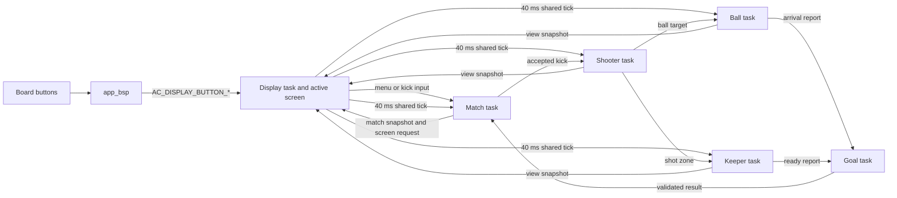
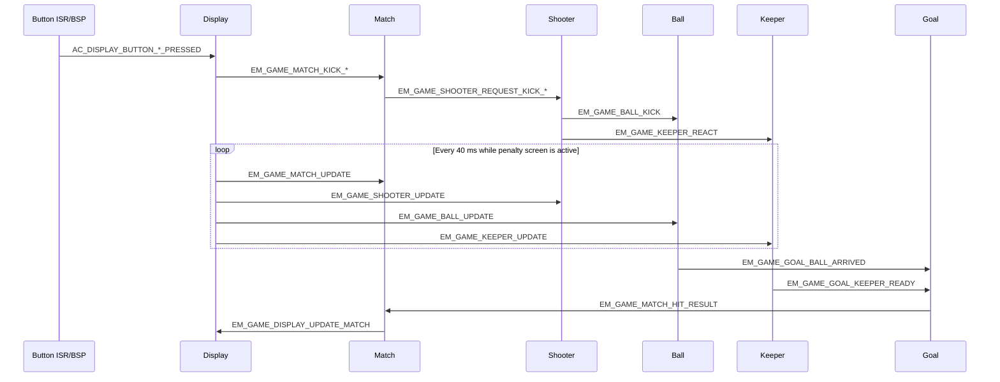

# Eleven Meter runtime signal flow

This document shows the end-to-end AK signal path from button input to rendering. Object-level payload details are documented in [Eleven Meter object sequences](03-design-sequence-object.md).

## Runtime overview

## Button to render sequence

The display task validates every received snapshot before updating its local render model. Match accepts input only in the appropriate phase and accepts a result only while revealing the current kick. The shared tick stops before leaving gameplay for the RIP screen.
